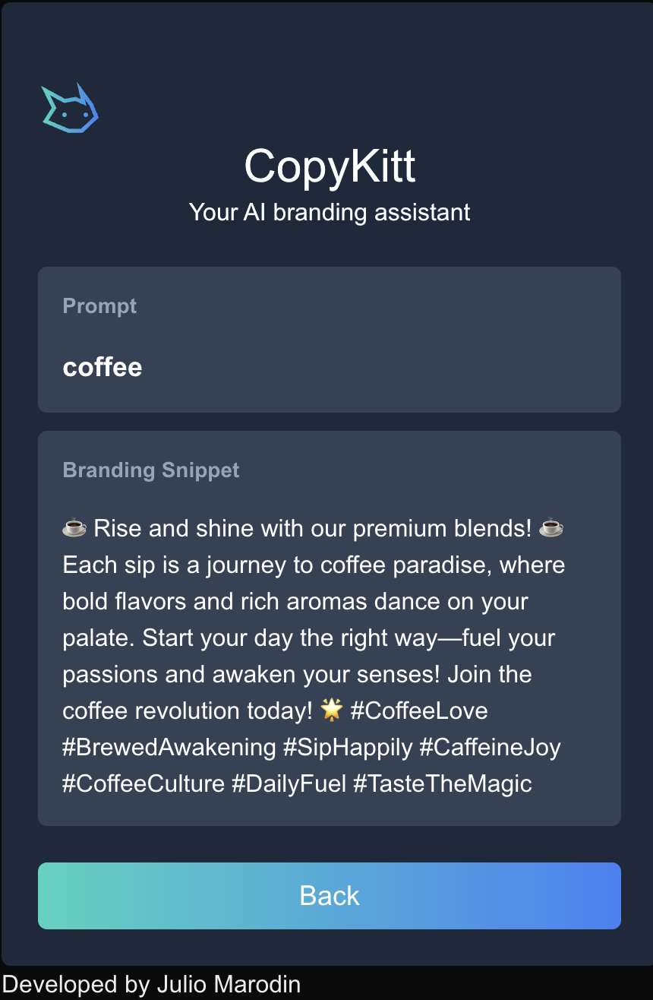

# Copykitt: Tutorial Project

This is a SaaS application that generates AI branding snippets and keywords for the customer's brand. 
It is a full stack application, and created as a tutorial for how to create AI driven full-stack
SaaS apps.

## Installation:

Create your virtual environment: `python -m venv venv`.

Enter your virtual environment: `. venv/bin/activate`

Install via pip: `pip install -r requirements.txt`.

## Usage:

Setting up your OpenAI Api Key:
Open a cdm prompt cd into the app folder and then `export OPENAI_API_KEY=your_key`.

Running:
Cmd prompt 1: `cd copykitt-site` and then `yarn dev`.

Cmd prompt 2: `cd app` and then `uvicorn copykitt_api:app --reload`.

Then change the `const ENDPOINT` insite copykitt-site/components/copykitt.tsx to `http://127.0.0.1:8000/generate_snippet`.

## Examples

## Lambda Layer ZIP

I've decided to actually commit the Lambda layer zip file itself along with the project since a
few people have told me they have trouble building this Docker image themselves.

So you can either follow the tutorial and try to build it (it's easier on a Linux or Mac), or if
it doesn't work, then just use the `copykitt-infra/lambda_base_layer/layer.zip` file I have provided.

## Tech Stack

#### Backend Stack

| Type      | Tech                                                         |
| --------- | ------------------------------------------------------------ |
| Language  | [Python](https://www.python.org/)                            |
| Framework | [FastAPI](https://fastapi.tiangolo.com/)                     |
| Hosting   | [AWS](https://aws.amazon.com/) (Lambda + API Gateway)        |
| Other     | [OpenAI](https://openai.com/), [AWS CDK](https://aws.amazon.com/cdk/), [Docker](https://www.docker.com/) |

#### Frontend Stack

| Type      | Tech                                                         |
| --------- | ------------------------------------------------------------ |
| Language  | [Typescript](https://www.typescriptlang.org/)                |
| Framework | [NextJS](https://nextjs.org/) / [React](https://reactjs.org/) |
| Styling   | [TailwindCSS](https://tailwindcss.com/)                      |
| Hosting   | [Vercel](https://vercel.com)                                 |

##